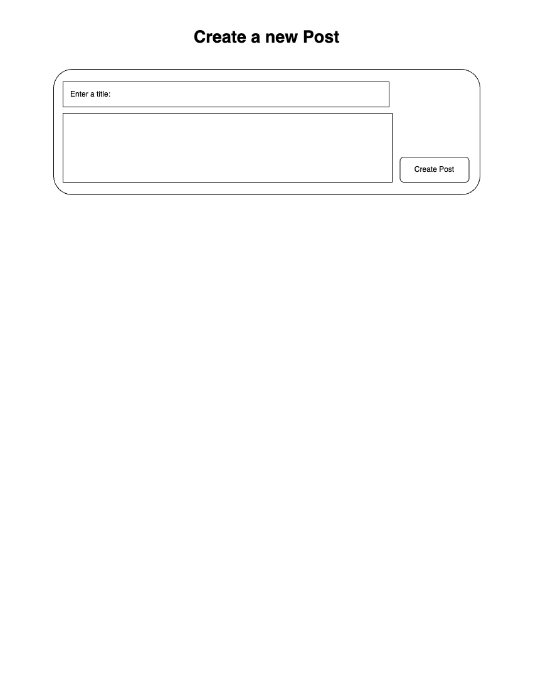
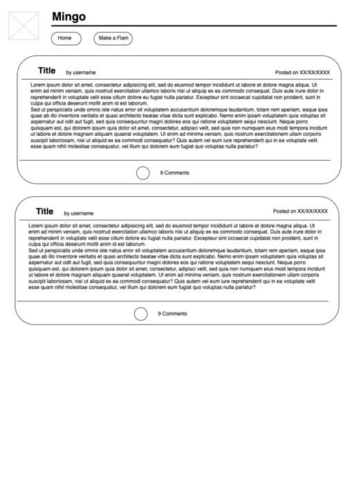
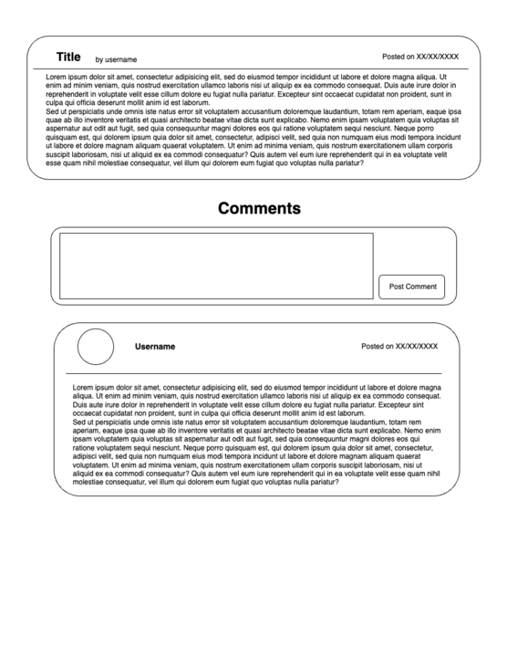

# Project Title: FLAM

## Project Summary: A text-based app that allows for posts and responses, similar to twitter.

### Team Members: Joshua Hsu, Harkirat Singh, Lily Smith.

## Roles: 
- Frontend - Harkirat/Lily 
- Backend - Lily/Josh/Harkirat
- Git wrangler - Josh
- Design lead - Josh 
- Research / Documentation lead - Lily

## Links:
[GitHub-Repository]( https://github.com/LSmith97/Mingo)

[Trello Board](https://trello.com/invite/b/rek017ZO/ATTIa5a1f7538c8e8d7c3ef526f8844f5231F97D273D/flam-mingo)

[Wireframe](https://drive.google.com/file/d/1x5AZFLjKs14rF1R2J-F7iv9hKKk1xqTD/view?usp=sharing)

## Primary Model/Schema - Post:

| Property            | Datatype          |
|---------------------|--------------------|
| _id                  | Objectid          |
| title                |   String          |
| body                 |   String          |
| comments             |   [objectID]      |
| isEdited             |   Boolean         |
| datePosted           |  Date             |
| associated_field     |   Ref: “Comment”  |

### Secondary Model / Schema - Comments:

| Property            | Datatype          |
|---------------------|--------------------|
| _id                  | Objectid          |
| parentId             |   String          |
| body                 |   String          |
| isEdited             |   Boolean         |
| datePosted           |  Date             |
| associated_field     |  Ref: “model3 or schema2”|

## MVP CRUD / Restful Routes:

| Route name | CRUD operation  | URL endpoint | Module name | Controller Action | Notes |
|------------|-----------------|--------------|-------------|------------------|-------|
| POST       | Create          | /posts       |create       | .create()         | Create all posts |
| GET        | Read            | /posts       |Index        | .find()           | Show all posts |
| GET        | Read            | /posts/:id   |Show         | .findById()       | Display the individual posts and comments  |
| GET        | Read            | /posts/new   |new       |          | Form |
| GET        | Read            | /posts/:id/edit |edit: editPost   |        | Form to edit|
| PUT       | Update          | /posts/:id       |Update: updatePost       | .findById( ).save( )  |Update Post |
|DELETE    | Delete           |/posts/:id        | delete    |.deleteOne()   | 
|ROUTES FOR COMMENTS   |
|POST | Create | /posts/:id/comments | create | findById().push().save() |Create Comments|
|DELETE | Delete | /posts/:id/comments/commentsId | delete | deleteOne() | |
|POST | Update | /posts/:id/comments/:commentId |Update:updatePost | findById().save() | Updates post

## User Story

[ERD](https://app.diagrams.net/#G1XqHD4tl-wugBCIuxH7z8KgYK0WxcPcDF)
### As a user 
- I want to be able to see all posts on the index page
- I  want to be able to delete posts that I have made.
- I want to be able to make text-based posts.
- I want to be able to view the details of a post
- I want to be able to leave comments on posts
- I want to be able to delete posts
- I want to be able to edit posts and demonstrate that it's been edited.

## Optional - Icebox Features 
### As a user 
- I want to be able to sign in using Google OAuth2
- I want to be able to view all comments and posts that another user has made.
- I want to leave comments on comments

## Wireframe Screenshots

### 1

### 2 

### 3
